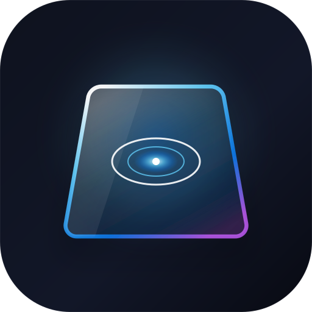
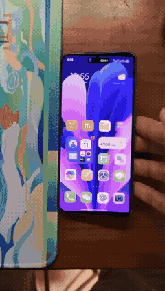
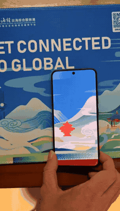
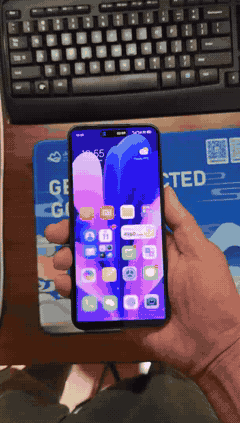

# DuoDepth 📱✨

<div align="center">
  
  <h3>What if your phone screen wasn't a display, but a magic window?</h3>
  <p><b>A real-time 3D optical illusion app for Android that turns your screen into a piece of frosted glass floating above your desk.</b></p>
  
  <p>
    
    
    
    
  </p>
</div>

---

## 🔮 The Illusion

Imagine placing your favorite photo flat on your desk. Now take a sheet of semi-transparent frosted glass and hold it right above the picture. 

- **Lay your phone flat on the desk:** The image is 100% razor-sharp, filling your screen from corner to corner.
- **Tilt the top edge up:** The bottom edge stays "glued" to the desk, while the top edge floats up into the air. As it lifts higher, the background naturally shrinks in perspective and melts into dreamy, silky camera bokeh.
- **Spin it, tilt it sideways:** The phone acts like a moving magnifying glass into a world printed directly onto your table.

It’s inspired by the futuristic dual-screen and spatial depth concepts (like the *iPhone Duo* concept)—reimagined as an interactive physics playground you can hold in your hand!

---

## 🎬 Real Device Demos

<div align="center">

| 📱 3D Perspective & Bokeh | 🪟 Magic Window on Desk | 🔄 Multi-Axis Dynamic Hinge |
| :---: | :---: | :---: |
|  |  |  |
| **Icons Melt into Silky Bokeh**<br/>Tilting lifts the icons into 16-tap Vogel blur | **Aligned with Physical Desk**<br/>Screen image perfectly matches the real mat beneath | **True 3D Relative Calibration**<br/>Smooth pitch & roll without gimbal lock |

</div>

---

## 🎮 How to Play

| Gesture / Action | What Happens |
| :--- | :--- |
| **Tilt your phone** | Watch the photo stay pinned to your desk while the lifted edges blur into the distance! |
| **Tap anywhere** | Instantly hides or shows the glassmorphism control panel (no annoying popups). |
| **Choose Image** | Drop in your favorite photo, wallpaper, anime art, or landscape from your gallery. |
| **Calibrate** | Lay back on the sofa or hold your phone at an angle, hit **Calibrate**, and that exact pose becomes your new "level ground"! |
| **Toggle Gestures (Switch)** | Flip the switch to pan around the image with one finger, or pinch-to-zoom up to 5×! Flip it off to lock your composition in place so you can tilt without accidental drags. |
| **Reset Photo** | One tap brings your picture right back to the center, perfectly cropped to fit your screen. |

---

## 🎛️ Fun Knobs to Play With

- 🔍 **Camera FOV Slider (5° – 90°)**:
  - Slide down to **5°**: Turns into an extreme telephoto lens with dramatic isometric, orthographic vibes.
  - Slide up to **90°**: Transforms into an action-cam wide-angle view where depth curves aggressively!
- 🔭 **Viewpoint Distance (0.1× – 2.0×)**:
  - Bring the virtual observer super close to the table or pull back for a bird’s-eye perspective.
- 🌫️ **Depth Blur Aperture (0% – 100%)**:
  - Dial it up for rich, creamy, buttery f/0.95 lens bokeh, or tone it down for a subtle mist.

---

## ⚡ Secret Sauce (Under the Hood)

No dry math textbook formulas here—just the fun engineering tricks that make it feel alive:

1. **The "Glued to Desk" Raycaster**:
   Instead of drawing a 3D box on your screen, a virtual camera in the sky casts rays through every single pixel on your phone down to the tabletop. The screen shrinkage exactly cancels out what your eyes see, pulling off the optical magic trick.
2. **Zero-Lag Gyroscope Engine**:
   Updates at 200 Hz with adaptive filtering. When you move fast, it kicks into high-gear instant response (under 10 milliseconds of delay!). When your hand rests, it smooths out tiny hand tremors.
3. **Creamy Vogel Bokeh (No Fake Bloom)**:
   A lot of blur shaders just add a cheap glowing fog. DuoDepth uses a 16-point golden-spiral disc convolution with hardware mipmap filtering. High-contrast letters and icons don't just glow—they genuinely dissolve into real frosted glass diffusion.
4. **Zero-Seam Screen**:
   We ditched thousands of clunky 3D grid triangles for a pristine full-screen quad. Zero cracks, zero lines, zero tearing.
5. **Background Sleep Guardian**:
   Switch apps, take a call, or lock your screen—when you come back, your photo and exact zoom position are instantly right where you left them.

---

## 🚀 Get the APK

### Build Debug APK
```bash
# Windows
.\gradlew.bat assembleDebug

# macOS / Linux
./gradlew assembleDebug
```
👉 Generated at: `app/build/outputs/apk/debug/app-debug.apk`

### Build Signed Release APK
Out of the box, automated signing is already set up with `keystore.properties`:
```bash
# Windows
.\gradlew.bat assembleRelease

# macOS / Linux
./gradlew assembleRelease
```
👉 Generated at: `app/build/outputs/apk/release/app-release.apk`

---

## 🎨 The Icon

The app icon is designed in a minimalist spatial computing aesthetic:
- A tilted perspective frosted glass pane hovering in deep space.
- A glowing optical depth aperture ring at its heart.
- Check out the raw vector file in the root directory: [`duodepth_icon.svg`](duodepth_icon.svg).

---

## 📜 License

Crafted with ❤️. Licensed under the [MIT License](LICENSE).
